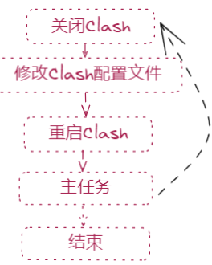
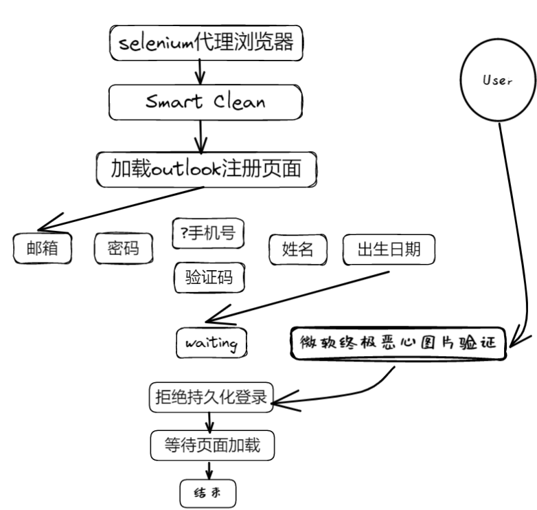
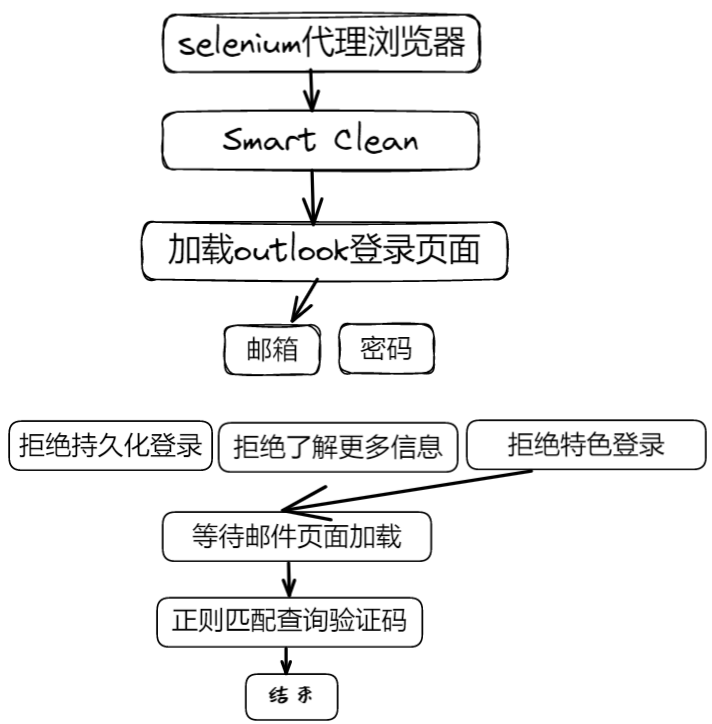
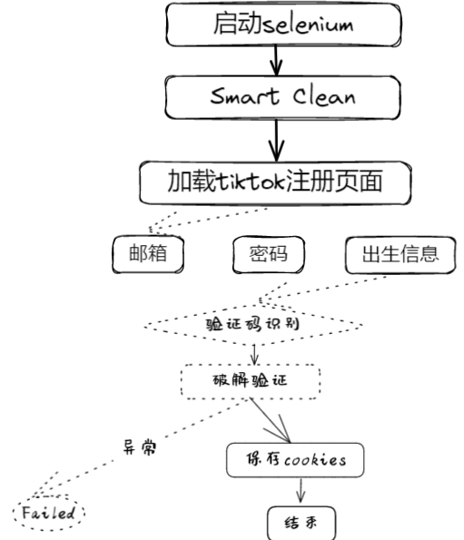
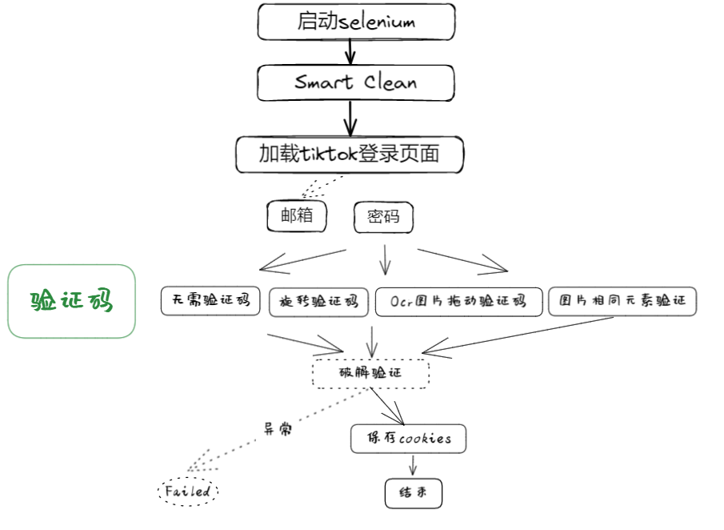
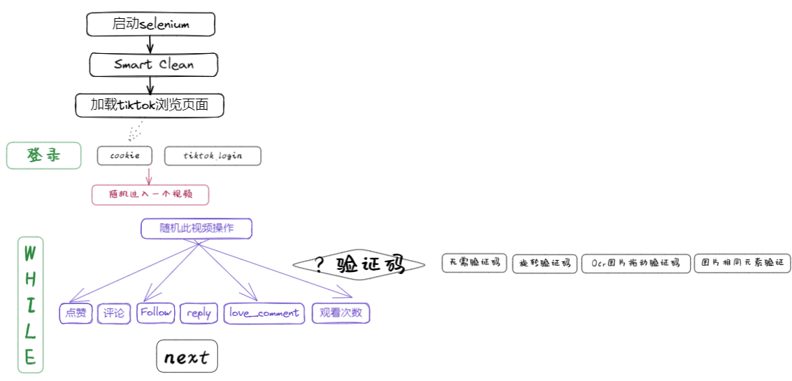
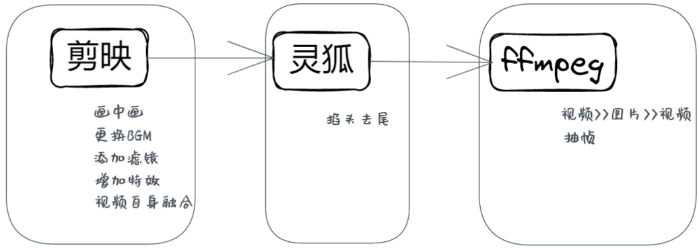

# Tiktok
这是一套自媒体创作工具，主要针对tiktok，但是也可以快速的兼容其它平台。实现的功能如下，包括
注册登录tiktok
模拟浏览tiktok
下载tiktok视频
剪辑tiktok视频

这一套流程看似简单，实际上却非常复杂。
## Utils
### 防止反爬
由于很多网页会通过不同的方式来进行爬虫检测，所以通过一些手段来实现防止反爬是很重要的。本项目使用的反爬手段包括以下四种。   

1. 更改IP地址
2. 使用魔改版的Chrome浏览器
3. 浏览器插件
4. js脚本
#### 更改IP地址
本人使用的window系统，常用的VPN代理软件是Clash，本人订阅一个IP代理套餐，可以使用少量的代理IP.所以通过设置Clash的工作状态来实现切换IP地址。



这里的主任务代表tiktok的网页操作，包括不限于登录注册 模拟浏览等等。
#### 魔改版的Chrome
参考此链接，https://github.com/2833844911/cychrome ，该浏览器是对Chrome源代码进行修改，甚至可以直接修改浏览器指纹，同时可以直接在命令行终端修改内部参数，真的很强大，但是我并没有仔细研究过。基于Node环境也可以实现Chrome，所以该团队也利用node实现的自己的chrome干一些事情。
#### 浏览器插件
浏览器插件包括使用User Agent代理修改agent，使用随机指纹来防止页面查询指纹来鉴别是否为同一用户，使用Smart Clean插件来删除浏览器数据。
```
这里简单介绍Smart Clean的插件，通过修改其源代码实现基于页面的自动配置，包括自动显示在页面右下方，清除浏览器缓存，cookie，密码等等几乎全部信息。 
```
#### Js脚本
参考https://github.com/requireCool/stealth.min.js，使用很简单，读取js让后将脚本加入到webdriver，但是并不知道实现的细节。

### Sqlite数据库操作
包括数据库的创建，以及内容的增删改查，具体参考utils/sqlite_db.py。

### IP自查
利用http://myip.ipip.net/来查询本机的IP地址和所在的区域。


### 视频类型识别
利用ffmpeg强大视频处理功能来识别视频的具体类型。


### Common
1. 清理不用的文件   
2. 获取最新的文件   
3. 鸣喇叭提示
4. 配置request通过本地代理来实现fq爬取数据

### 验证码识别
Tiktok里面有两种验证码，一种是基于内外圈图片旋转对齐的验证码，第二种是Ocr识别的验证码.
#### rotate_captcha
clone github开源仓库，原仓库在这里https://github.com/ycq0125/rotate_captcha/tree/main。
#### ocr识别验证码
本项目的Ocr识别主要是利用ddddocr,github开源链接为https://github.com/sml2h3/ddddocr，真的是简单好用，向大佬致敬......

```
Tesseract是谷歌开发并开源的图像文字识别引擎，针对单个字符也具有良好的识别率，但是还是ddddocr更好用。
```

### Loguru
利用loguru格式化配置终端的打印输出，可以配置不同的日志等级，还可以方便写入到日志文件，并且可以针对不同的日志等级打印输出不同的格式。
参考 logging/loguru

## 注册登录Tiktok
### 注册outlook邮箱
微软的outlook邮箱可以无限注册，甚至可以同一IP无限注册，只是有时候需要提供手机验证码。不愧是大厂。所以很多想做tiktok矩阵的人都是用outlook邮箱。


```
遗憾的是，并没有实现全部的自动化，微软的终极恶心图片验证种类多样，而且很多时候得连续验证五次。匹配图片中的目标物体数量的验证码实在是巨TM难，就算是我真人，也表示过不了不在于我，这个设计师真的反人类(,,•́ . •̀,,)
```
### 登录outlook邮箱


利用selenium登录outlook邮箱，然后最新的能匹配到特定正则表达式的邮件，返回抓取到的验证码。
#### Selenium
本项目采用不同的方式来启动selenium：  
1. webdriver.Chrome( )
2. webdriver.edge( )
3. webdriver 代理连接本地chrome

```
这里详细介绍webdriver代理连接本地chrome的方案,首先利用subprocess的命令行终端功能启动chrome外部浏览器，然后在webdriver配制的时候设置为代理外部浏览器，即可实现webdriver代理连接本地chrome。 
```
### 注册tiktok


这个流程并没有完全走通，主要问题在于注册页面禁止短时间多次尝试，更换IP，清除浏览器数据，更改浏览器指纹，修改Agent等方法都不能绕过识别。（换一个浏览器纯手动填写信息有时候就可以注册成功，求解答.....Why?应该怎么处理）


### 登录tiktok

## 模拟浏览tiktok

除了上诉操作以外，这部分还支持修改用户的avatar，增加一些用户行为，让该账号更加真实。
```
登录tiktok之后，选择更换用户信息，进入avatar配置部分，然后上传本地avatar图片。本地的avatar图片是http://pic.netbian.com网页展示的高清美图，使用过后会自动删除本地图片。注意，在软件设置avatar之前需要手动利用utils/downpicture/picdown.py将图片下载保存到本地。
```
## 下载tiktok视频
利用snaptk平台接口来实现tiktok(douyin)的高质量无水印视频的下载，具体请参考utils/snaptk.py
## 剪辑tiktok视频
在tiktok视频搬运的过程中，需要对视频进行一些简单的处理，用于逃过tk的视频检测算法。一般采用的方法如下：
1. 掐头去尾      
2. 画中画   
3. 更换BGM     
4. 添加滤镜   
5. 增加特效   
6. 视频自身融合（删除视频的第一帧，然后和原视频融合在一起）
7. 抽帧
而在视频处理工具中，剪映是一款对用户非常友好的视频处理软件，简单上手，里面有各种特效和滤镜，使用起来方便。关键在于其数据的存储为json格式，而且为明文存储，所以可以方便对其进行操作。

针对剪映的自动化处理，有两种方式，一种是通过修改json文件，实现视频的编辑，第二种是通过uiautomation对桌面进行监测和自动化控制。本项目的剪映的操作部分主要参考https://github.com/JianYing-Automation/JianYingApi，但是对其进行了拓展。首先本项目基于原项目优化srt字幕文件的提取，主要是利用uiautomation来拖拽音视频元素到轨道，然后利用剪映自带的字幕提取功能。本项目对于tiktok设计的亮点在于仅仅需要修改配置文件"Content_Json_File"，本项目即可以设计出你需要的视频，将视频，特效，滤镜等加入到剪映中，具体的实现方法就是修改json配置文件。

这是利用剪映来实现画中画，更换BGM,添加滤镜，增加特效，视频自身融合等效果。而这是不够的，下面需要用到灵狐剪辑软件来实现视频的掐头去尾。
最后为了修改视频的签名，利用ffmpeg将视频帧提取为图片，然后将图片按照帧数拼接为视频，在拼接的过程中对视频进行抽帧。



# Others
tiktok_json_deal.ipynb是开始尝试修改json来配置剪映时候的尝试，留个纪念吧。